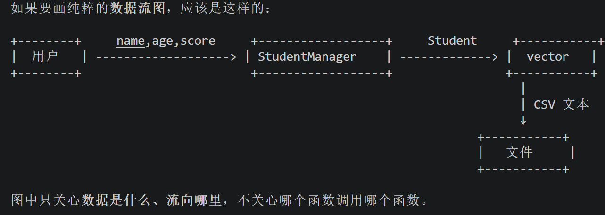

# 其实最困惑我的是怎么设计系统架构，怎么梳理模块之间的关系？                                          
● 这是个核心问题。我用你当前的学生管理系统来拆解"怎么想出这个架构"的过程。                               
  设计架构的起点：从需求中找"职责"                                                                       
  回到需求，这个系统要做什么？                                                                                                                                                                              
  1. 和用户交互（显示菜单、接收输入）
  2. 处理业务逻辑（添加、删除、修改、查询、统计）
  3. 存储数据（读写文件）

  这三件事天然就是三个不同的职责。如果你把所有代码写在一个 main 函数里，会发现：

  - 用户交互的代码和数据处理的代码混在一起
  - 文件读写的代码和业务判断的代码混在一起
  - 改菜单样式时可能不小心改坏了存储逻辑

  所以第一步思考就是：按职责拆分，让每块代码只管一件事。

  拆分的过程

  第一层拆分：谁管数据？

  学生这个概念应该有自己的"形态"——学号、姓名、年龄、成绩。这些属性天然属于一个整体，不应该散落在各处。
  于是有了 Student 类：

  Student：我只管"一个学生长什么样"

  第二层拆分：谁管一堆学生？

  你有很多个 Student，需要有人来管理它们——增删改查、排序、统计、存文件。这些操作的对象是"学生集合"，不
  是"单个学生"。于是有了 StudentManager：

  StudentManager：我管"所有学生"——你告诉我要做什么，我来执行

  第三层拆分：谁和用户说话？

  菜单显示、输入接收、结果展示，这些是"用户能看到的界面"。它不应该关心数据怎么存、业务怎么算。于是    
  main.cpp 只做一件事：把用户的选择翻译成对 StudentManager 的调用：

  main.cpp：我管"和用户沟通"——用户说做什么，我转达给 StudentManager

  模块之间的关系怎么确定？

  问自己一个问题：谁依赖谁？谁需要知道谁的存在？

  main.cpp 需要调用 StudentManager 的方法    → main 依赖 StudentManager
  StudentManager 需要创建、操作 Student 对象  → StudentManager 依赖 Student
  Student 不需要知道任何其他模块               → Student 是最底层

  依赖关系是单向的：上层可以调用下层，下层不需要知道上层的存在。

  类比一个公司：

  用户 → main.cpp（前台接待）
          → StudentManager（部门经理）
                → Student（员工）

  - 前台不需要知道员工怎么工作，只需要告诉经理要做什么
  - 经理知道每个员工的情况，负责调度
  - 员工只管自己的事情

  一个判断架构好坏的简单标准

  改一个需求时，需要改动多少个文件？

  - 改菜单样式 → 只动 main.cpp（好）
  - 改存储格式 → 只动 Student 的序列化方法（好）
  - 改业务规则 → 只动 StudentManager（好）

  如果改一个需求需要同时改三个文件，说明职责划分有问题。

  总结：设计架构的思考顺序

  1. 列出系统要做的事（从需求出发）
  2. 把"做事"按职责分类（哪些事是一类的）
  3. 每类职责变成一个模块/类
  4. 确定模块之间的依赖关系（谁调用谁）
  5. 保证依赖是单向的，不要循环依赖

  你现在可以拿你的代码对着这个思路走一遍，看看每个类是不是真的"只管一件事"。这比记设计模式有用得多。

# 我想在说一下我的对于软件开发的一些方法，如果有哪些不对的你可以给我补充一下。软件开发需要从客户需求  去输出一系列文档。比如需求说明书，这个需求说明书里面主要是这个软件的功能，简单说一下各个功能的输入和  输出，还有其他个文档用来帮助编码。先完成所有文档然后再根据文档去完成编码实现功能对吗？你可以给我展开  讲讲软件开发的流程，这个流程是否是开发编码通用的？
  ● 你的理解大致正确，但有一些需要补充和修正的地方。   实际的软件开发流程                         
  你说的"先写完所有文档再编码"是一种理想化的过程。实际中有几种常见的开发模型：                                                                                                                              
  1. 瀑布模型（你描述的这个）

  需求分析 → 概要设计 → 详细设计 → 编码 → 测试 → 维护

  每个阶段完成后才进入下一个，文档驱动。这是最传统的方式。

  优点：流程清晰，文档齐全，适合需求明确且不会变的项目
  缺点：如果在编码阶段发现需求有问题，要回头改前面的文档，成本很高

  2. 迭代/增量模型

  第一轮：需求(部分) → 设计 → 编码 → 测试
  第二轮：需求(补充) → 设计 → 编码 → 测试
  第三轮：...

  不是一次性写完所有文档，而是做一轮、验证一轮、再做下一轮。

  3. 敏捷开发（目前业界最主流）

  用户故事 → 小版本开发(1~2周) → 交付可用的软件 → 收集反馈 → 下一轮

  强调快速交付可用的软件，文档精简，靠频繁沟通代替大量文档。

  ---
  关于"是否通用"

  这些流程适用于大多数软件开发，但具体用哪种取决于：

  ┌──────────────────────┬──────────────────────────────────────────┐
  │         场景         │                 推荐模型                 │
  ├──────────────────────┼──────────────────────────────────────────┤
  │ 航天、医疗、金融系统 │ 瀑布模型（要求文档完整，每步可追溯）     │
  ├──────────────────────┼──────────────────────────────────────────┤
  │ 互联网产品、App      │ 敏捷开发（需求变化快，快速迭代）         │
  ├──────────────────────┼──────────────────────────────────────────┤
  │ 课程作业、个人项目   │ 瀑布或简化流程（像你现在的学生管理系统） │
  └──────────────────────┴──────────────────────────────────────────┘

  你当前的项目用简化版瀑布模型是合适的，因为需求明确、规模小。

  ---
  对你当前理解的修正

  你原来的理解：

  ▎ 先完成所有文档，然后根据文档去完成编码

  更准确的说法是：

  ▎ 文档和编码是相互验证的，不是单向的

  实际过程中会发生这样的事：

  1. 写需求文档时，可能还没想清楚某些细节
  2. 写设计文档时，发现需求有漏洞，回去补充需求
  3. 编码时，发现设计不合理，修改设计
  4. 测试时，发现功能有 bug，回到编码修复
  5. 测试通过后，文档和代码保持一致

  所以文档不是一次写完就不再动了，而是会随着开发过程不断修正。

  ---
  对你现在项目的建议

  你的学生管理系统已经完成了"编码"阶段，并且生成了对应的文档。下一步有意义的做法是：

  1. 按测试用例文档跑一遍测试，验证代码是否真的符合需求
  2. 如果发现实际行为和文档描述不一致，修正文档或修正代码，让两者一致

  这个"发现不一致→修正"的过程，就是软件开发中最真实的部分。
# 我看过需求文档后，然后看addStudent这个功能的实现代码，我有两个疑问，疑问1：学号是通过后自增运算符实 现的自增效果，但为什么第一个存储的学号是1呢？我没看到有初始值1，或者默认初始值是0，通过后自增运算符应 该先传入的是0，然后自增为1的，总之应该是0开始呀！疑问2：我看打开文件没有显示设置打开方式，默认则是std ::ios::out模式，是截断的模式，则原文件存储的内容会被覆盖掉，但是我打开文件看了一下原记录仍存在就像是  使用了追加模式一样。                                                                                  
                                                                          
● 两个问题都很好，说明你在认真读代码。让我帮你确认。疑问 1：学号为什么从 1 开始？   
  你说得对，后自增 nextId++ 确实是先用旧值再自增。但关键在于 nextId 的初始值是 1，不是 0。                                                                                                                  
  看 StudentManager.cpp:10：

  StudentManager::StudentManager(const std::string& filePath)
      : filePath(filePath), nextId(1) {
      loadFromFile();
  }

  构造函数的初始化列表里 nextId(1) 把初始值设为了 1。

  所以第一次添加时：
  - Student s(nextId++, ...) → 先用 nextId=1 创建学生，然后 nextId 变成 2
  - 学号确实是 1

  如果初始值设为 0，那第一个学号才会是 0。

  ---
  疑问 2：文件真的被覆盖了吗？

  你再仔细看一下文件内容。std::ofstream 默认确实是截断模式（std::ios::trunc），每次 saveToFile()      
  都会把整个 vector 重新写一遍。

  关键在于：saveToFile() 写入的是内存中 students 向量的全部数据，不是只追加一条。

  流程是这样的：

  1. 启动程序 → loadFromFile() 把已有数据读入内存
  2. 添加学生 → 新学生加入内存的 students 向量
  3. saveToFile() → 把内存中所有学生（旧的+新的）重新写入文件

  所以虽然文件被"截断覆盖"了，但因为写入时包含了所有数据，效果看起来就像数据都在。你可以验证一下：添加
  学生后，再用记事本打开
  students.txt，你会发现整个文件被重写了，不只是末尾多了一行——只是内容恰好是"旧数据+新数据"。

  你可以做一个实验来验证：手动编辑 students.txt，在某一行末尾加一段无意义的文字（比如
  aaa），保存。然后回到程序执行添加学生操作，再打开文件看看那段 aaa
  是否消失了。如果消失了，就说明文件确实被完整重写了。
# 我看了docs里的所有文档，由于我是第一次接触这种完整且标准的开发流程，感觉有很多新东西有点看不过来了  ，我现在应该做什么？要根据文档去看代码的实现或者看代码实现前自己心里面大概去想一下如何实现，然后再去  对比一下标准的实现代码吗？                                                                                                                                                                                  
● 你的想法方向是对的。对于第一次接触完整流程，最重要的是建立"文档→代码"的映射感，而不是死记硬背每个文 
  档。
                                                                                                        我建议你按这个顺序来做：                                                                            
                                                                                                        第一步：只读需求文档，不看代码                                                                      

  打开 01-需求规格说明书.md，读完后合上文档，问自己：

  - 这个系统要做什么？（6 个功能）
  - 每个功能的输入是什么、输出是什么？
  - 有哪些校验规则？（年龄 0-150，成绩 0-100）

  能用自己的话大致说出来就够了。

  第二步：带着需求去读代码

  逐个功能对照着看。比如读完需求里的"添加学生"后，打开 StudentManager.cpp 找到 addStudent()
  函数，验证：

  - 需求说要校验年龄，代码里有没有？
  - 需求说学号自增，代码怎么实现的？
  - 需求说要写入文件，代码在哪一步做的？

  这一步的目的是确认代码确实实现了需求。

  第三步：设计文档先略读

  02-概要设计 和 03-详细设计
  现在不用细看。等后续你要修改代码或加新功能时，再回头看这两篇，它们会帮你理清"为什么要这样设计"。    

  第四步：测试用例可以试着跑几个

  打开 04-测试用例文档.md，挑 2-3 个简单的手动测一下，比如：

  - TC-001：正常添加一名学生
  - TC-008：输入年龄 151，看看是不是真的报错

  亲自跑一遍比看十遍文档印象深。

  ---
  总结一下建议：现在不要试图一次性理解所有文档。先用"需求→代码"这一个对照关系建立基础认知，其他文档等 
  实际用到时再看。
# 应该怎么做去能够锻炼这种思维，我觉得我这方面是小白，我想掌握这种能力                              
● 锻炼这种思维没有捷径，但有一个很有效的方法：拆解现有的东西。练习方法 阶段一：拿你自己的代码练手 你现在已经有完整的学生管理系统了。试试这样做：练习 1：假装要加一个功能，看需要改哪里  
  比如"增加一个功能：按成绩排序后显示所有学生"。
  你在心里想：
  - 这个功能是"管理一堆学生"的事还是"单个学生"的事？
  - 是排序学生集合，所以是 StudentManager 的事
  - 需要改哪些文件？StudentManager 加一个方法，main.cpp 加一个菜单选项
  - Student 需要改吗？不需要

  如果你的答案和上面一致，说明你的直觉是对的。

  练习 2：故意打乱架构，感受后果

  想象把 StudentManager 的逻辑全部塞进 main.cpp，然后问自己：
  - 菜单显示和文件读写混在一起，读起来什么感觉？
  - 如果要改存储格式，是不是要在一堆菜单代码里找？

  不需要真的改代码，在脑子里过一遍就行。目的是体会"职责混乱"的不适感，这样你就知道为什么要拆分。      

  阶段二：分析别人的系统

  找一些简单的系统，不看代码，只看功能描述，自己先想怎么分模块。比如：

  题目：图书馆管理系统
  - 功能：添加图书、借书、还书、查询图书、查询借阅记录
  - 你自己先想：应该有几个类？谁依赖谁？

  想完之后再和参考答案对比。不需要追求和标准答案一样，重点是你能自圆其说。

  阶段三：从零做一个小项目

  不要太大，比如：

  题目：记账本
  - 功能：记录收支、按类别统计、数据保存到文件
  - 从需求文档开始写，自己设计架构，自己编码

  做的过程中你会遇到各种纠结："这个功能放哪个类里？"——纠结本身就是锻炼。

  一个核心心法

  每次遇到"这个该放哪里"的问题时，问自己一句话：

  ▎ "这件事是'谁'的职责？"

  - 显示菜单是"界面"的事
  - 校验数据是"业务逻辑"的事
  - 读写文件是"数据存储"的事

  分不清的时候，就问：如果以后要改这件事，我最不希望改动哪里？ 把它放到最不容易被波及的位置。

  不建议做的事

  - 不要现在去学设计模式（工厂、单例、策略等），那是进阶内容，你现在学了也用不上
  - 不要追求"完美的架构"，先追求"每个模块只管一件事"
  - 不要只看不动手，思维是靠实际决策练出来的，不是靠看书看出来的

  你可以从练习 1 开始，先拿自己现有的代码练。
# 架构是不是一般都是用户交互是个模块，功能实现是个模块，底层数据结构是个模块，一般是这三层。还有其他  得吗？更复杂的是怎样的？                                                                              
                                                                                                      
● 你说的三层是最经典的分法，叫三层架构，也是最常见的。但实际情况会有变化。                                                                                                                                  
  你总结的三层                                                                                                                                                                                              
  用户交互（表现层）    → 用户看到什么、输入什么
  功能实现（业务逻辑层） → 怎么处理、怎么算                                                             底层数据（数据层）     → 数据长什么样、怎么存
                                                                                                      
  这三层适用于大多数应用程序。你当前的学生管理系统就是这个结构。

  什么时候需要更多层？

  当系统复杂到某一层内部也有明显职责差异的时候，就需要拆分。

  比如业务逻辑层变复杂了

  假设你的学生管理系统要加这些功能：
  - 导入学生数据（从 Excel 文件）
  - 数据校验规则变复杂（姓名不能重复、学号格式有要求）
  - 不同角色看到不同功能（管理员能删除，普通用户只能查）

  这时候"功能实现"这一层就太粗了，会拆成：

  表现层
    ↓
  接口层（Controller）    → 接收请求，决定调用哪个业务
    ↓
  业务层（Service）       → 具体的业务规则和计算
    ↓
  数据访问层（DAO/Repository）→ 只管读写数据库/文件，不关心业务
    ↓
  数据层

  再比如有多个用户交互方式

  同一个系统既要给网页用，又要给手机 App 用：

  网页界面 ──→ ┐
  手机界面 ──→ ├→ 统一的接口层 → 业务层 → 数据层
  命令行界面 ─→ ┘

  底层逻辑完全一样，只是入口不同。

  更复杂的架构长什么样

  举几个真实场景：

  电商系统
  前端（网页/App）
    ↓
  网关层（统一入口、限流、鉴权）
    ↓
  微服务层（每个功能是一个独立服务）：
    - 用户服务
    - 商品服务
    - 订单服务
    - 支付服务
    ↓
  数据层（每个服务有自己的数据库）

  这种架构的特点是：一个功能出了问题不影响其他功能，每个服务可以单独部署和扩展。

  有缓存的系统
  表现层 → 业务层 → 缓存层(Redis) → 数据层(数据库)

  因为数据库读取慢，在中间加一层缓存，热门数据直接从内存返回。

  但你不需要现在学这些

  你现在要掌握的是：

  1. 三层架构是基础，绝大多数项目够用了
  2. 更复杂的架构是因为某一层撑不住了才拆分的
  3. 拆分的原则始终是一样的：一个模块只管一件事

  等你做的项目多了，遇到"这一层代码太乱、改不动"的时候，自然就知道该拆了。到时候再学更复杂的架构，才有
  体感。

  先把你当前的三层练熟，这是一切的基础。
# 现在回顾最初的起点，我应该怎么从这个现有项目（学生管理系统）去学习呢？                              

● 现在你有了完整的代码和文档，学习路径很清晰。                                                                                                                                                              
  第一步：让代码跑起来，感受它                                                                        
                                                                                                        不要急着改代码或读代码。先做这几件事：                                                              
                                                                                                        - 编译运行，把 6 个功能都用一遍
  - 添加几个学生，删除一个，修改一个，查询一下，看看统计                                                - 故意输入一些错误的数据（负数年龄、超 100 的成绩），看看程序怎么反应                               

  目的：建立对这个系统的直观感受，知道它"做了什么"。

  第二步：带着问题读代码

  打开需求文档，对照代码，逐个功能过一遍。不用一次全看完，一次只看一个功能。

  比如今天只看 addStudent()：

  读需求文档 → 需求说要校验年龄和成绩
  读代码 → 找到 addStudent() → 看到 age < 0 的判断 → 确认：代码实现了需求

  然后问自己几个问题：
  - 如果用户输入的 age 是字母而不是数字，会发生什么？
  - 如果 name 里有空格，会发生什么？

  不需要现在解决这些问题，发现问题本身就是学习。

  第三步：动手改，哪怕是很小的改动

  只有真正改代码，你才能理解架构为什么这样设计。

  建议从简单到难：

  初级改动：改显示效果
  - 把菜单的提示文字从英文改成中文
  - 这会让你熟悉 main.cpp 的结构

  中级改动：加一个简单功能
  - 给统计功能加一个"按分数段统计"（优秀 90+、良好 80+、及格 60+）
  - 这会让你理解 StudentManager 的工作方式

  进阶改动：修一个真实的 bug
  - addStudent() 中如果用户输入非数字的 age，程序会出问题
  - 试着修复它，这会逼你理解输入处理的完整流程

  第四步：写自己的注释

  读代码时，在你觉得关键的地方写注释。比如：

  Student s(nextId++, name, age, score);  // 先用当前 nextId，然后自增

  不需要写很多，写注释的过程就是在强迫自己理解代码。如果某一行你写不出注释，说明你还没真正理解它。    

  第五步：删除功能，再加回来

  这是一个反向练习：

  1. 删除 queryStudent() 的所有代码，只留空函数
  2. 看需求文档，自己重新写一遍
  3. 和原来的代码对比，看看差异在哪里

  这个过程能帮你发现自己没想到的细节（比如重名的情况怎么处理）。

  今天的建议

  你现在就做第一步和第二步就够了：

  1. 运行程序，把所有功能试一遍
  2. 挑 addStudent() 这一个函数，对着需求文档读一遍代码

  不用贪多，一个功能吃透了，其他的自然就通了。

# 工作目录的问题
● 问题总结                  
  现象                                   
  - 终端运行程序：正常读取数据                                                                    
  - VS Code debug 运行程序：显示 "No records."，文件读取失败原因   
  launch.json 中配置了：

  "cwd": "${fileDirname}"

  ${fileDirname} 的值取决于你当前打开的源文件。比如打开 StudentManager.cpp 时，工作目录就是       
  student-manager/src/。

  而代码中使用的是相对路径：

  StudentManager manager("data/students.txt");

  相对路径是相对于工作目录的，所以程序在 student-manager/src/data/students.txt
  找文件，文件不在那里，打开失败。

  修复

  "cwd": "${workspaceFolder}"

  工作目录固定为项目根目录 newProgram，data/students.txt 就能正确找到。

  要记住的一点

  相对路径是相对于工作目录的，不是相对于 exe 所在目录的。 这是 Windows 和 C++ 中一个非常常见的坑。
# terminate called after throwing an instance of 'std::out_of_range'what():stod
那就确认了，6.9516e-310 这个值确实是 stod 报错的原因。

  之前我说它在 double 范围内是错的。让我解释一下真正的原因：

  std::stod 用的是 C 标准库的 strtod，它有精度下限。6.9516e-310 这个值太接近 0，超出了 strtod     
  能安全解析的范围，虽然 double 理论上能表示到约 5e-324，但 strtod
  的解析能力比这更保守，遇到这种极端小的值就会抛出 out_of_range。

  简单说：double 能存这个值，但 stod 解析不了这个字符串。
# 我在我的工作中遇到UML了，我不太熟悉UML，我看这个项目的概要文档好像也有类似的关于架构的内容，UML 是关于系统架构的知识吗？我想基于这个项目学习UML相关的知识 
 UML 不只是关于架构的，它是一套用图形来描述软件系统的标准方法。架构图只是其中一种。              
                                                                                                    UML 是什么                                                                                                                                                                                        
  UML（Unified Modeling Language，统一建模语言）就是用各种图来描述软件的不同方面。就像建筑图纸有平  面图、立面图、结构图一样，软件也有不同类型的图。                                                

  UML 常用的图（和你的项目对应）

  1. 用例图（Use Case Diagram）

  描述谁用系统、做什么。

  对应你的需求文档中的：
  - 用户 → 添加学生、删除学生、修改学生...

  2. 类图（Class Diagram）

  描述系统有哪些类、类之间什么关系。

  对应你的项目中的：
  - Student 类（属性、方法）
  - StudentManager 类（属性、方法）
  - StudentManager 依赖 Student

  3. 时序图（Sequence Diagram）

  描述一个操作的完整执行过程，按时间顺序谁调用了谁。

  比如"添加学生"的时序图：
  用户 → main.cpp → StudentManager.addStudent() → Student(构造) → saveToFile() → 文件

  4. 活动图（Activity Diagram）

  描述一个功能的流程，类似流程图。

  比如删除学生的流程：输入学号 → 查找 → 确认 → 删除 → 保存。

  5. 状态图（State Diagram）

  描述一个对象的状态变化。

  比如学生对象：创建 → 正常 → 被修改 → 被删除。

  和你项目的概要设计文档的区别

  概要设计文档是用文字描述架构，UML
  是用图形描述。内容是一样的，表达形式不同。图形更直观，文字更详细。

# 类图
● 好，基于你的学生管理系统，类图长这样：                                                             
  Student 类                                                                                         
  +------------------+                                                                              |     Student      |                                                                            
  +------------------+
  | - id: int        |
  | - name: string   |
  | - age: int       |
  | - score: double  |
  +------------------+
  | + getId(): int   |
  | + getName(): string |
  | + getAge(): int  |
  | + getScore(): double |
  | + setName(name: string): void |
  | + setAge(age: int): void |
  | + setScore(score: double): void |
  | + display(): void |
  | + toString(): string |
  | + fromString(line: string): Student |
  +------------------+

  StudentManager 类

  +------------------------+
  |    StudentManager      |
  +------------------------+
  | - students: vector<Student> |
  | - filePath: string     |
  | - nextId: int          |
  +------------------------+
  | - loadFromFile(): void |
  | - saveToFile(): void   |
  | + addStudent(): void   |
  | + deleteStudent(): void|
  | + modifyStudent(): void|
  | + queryStudent(): void |
  | + displayAll(): void   |
  | + showStatistics(): void |
  +------------------------+

  两个类的关系

  +------------------------+        1..*       +------------------+
  |    StudentManager      | ◆---------------> |     Student      |
  +------------------------+                   +------------------+

  箭头表示：StudentManager 拥有（包含）多个 Student 对象。

  图中符号的含义

  ┌────────┬───────────────────────────────────────────┐
  │  符号  │                   含义                    │
  ├────────┼───────────────────────────────────────────┤
  │ - 开头 │ 私有（private），外部不能直接访问         │
  ├────────┼───────────────────────────────────────────┤
  │ + 开头 │ 公有（public），外部可以调用              │
  ├────────┼───────────────────────────────────────────┤
  │ ◆      │ 组合关系，表示"拥有/包含"                 │
  ├────────┼───────────────────────────────────────────┤
  │ 1..*   │ 一个 StudentManager 包含 1 到多个 Student │
  ├────────┼───────────────────────────────────────────┤
  │ 第一格 │ 类名                                      │
  ├────────┼───────────────────────────────────────────┤
  │ 第二格 │ 属性（成员变量）                          │
  ├────────┼───────────────────────────────────────────┤
  │ 第三格 │ 方法（函数）                              │
  └────────┴───────────────────────────────────────────┘

  和你代码的对应

  类图其实就是把你的 .h 文件用图形画了出来：

  // Student.h 就是类图的第二格和第三格
  class Student {
  private:           // 对应 - 开头
      int id;
      string name;
  public:            // 对应 + 开头
      int getId();
      void setName();
  };

  所以你已经会读类图了——类图就是头文件的图形化表达。
# 类关系如何确定
● 一个简单的判断方法：看一个类的成员变量里有没有另一个类的对象。                                     
  看 StudentManager.h：                                                                              
  class StudentManager {                                                                            private:                                                                                        
      std::vector<Student> students;  // ← 这里有 Student
      std::string filePath;
      int nextId;
  };

  students 是一个装着 Student 的 vector，说明 StudentManager 拥有 Student。这就是它们之间的关系。 

  再看 Student.h

  class Student {
  private:
      int id;
      std::string name;
      int age;
      double score;
  };

  Student 的成员变量里没有 StudentManager，说明 Student 不知道 StudentManager 的存在。

  所以关系是单向的：StudentManager 知道 Student，Student 不知道 StudentManager。

  常见的类关系类型

  ┌────────────────┬───────────────────────────────────┬─────────────────────────────────────┐    
  │      关系      │             判断方法              │          你的项目中的例子           │    
  ├────────────────┼───────────────────────────────────┼─────────────────────────────────────┤    
  │ 组合（拥有）   │ A 的成员变量包含 B 的对象         │ StudentManager 拥有 vector<Student> │    
  ├────────────────┼───────────────────────────────────┼─────────────────────────────────────┤    
  │ 依赖（使用）   │ A 的方法中用到了 B，但 A 不拥有 B │ main.cpp 调用 StudentManager 的方法 │    
  ├────────────────┼───────────────────────────────────┼─────────────────────────────────────┤    
  │ 继承（是一种） │ A 是 B 的特殊类型                 │ 你的项目中没有                      │    
  └────────────────┴───────────────────────────────────┴─────────────────────────────────────┘    

  判断关系的步骤

  拿到任意两个类，问三个问题：

  1. A 的成员变量里有 B 吗？ → 有就是组合/聚合关系
  2. A 的方法里会用到 B 吗？ → 有就是依赖关系
  3. A 是 B 的一种吗？ → 有就是继承关系

  三个都不是，就没有关系。

  在你的项目里：
  - StudentManager 包含 Student → 组合关系
  - main.cpp 使用 StudentManager → 依赖关系（但 main 不是类，类图中通常不画）
# 项目从0到1完成流程
1. 项目流程
需求分析-->概要设计-->详细设计-->编码-->测试。
## 2. 需求分析
  需求：做一个学生管理系统
  思考--
    管理具体包括什么？添加，删除，修改，查询
    学生有那些信息？学号，姓名，年龄，成绩
    数据存在哪？本地文件
    有什么规则？年龄（0-150），成绩（0-100）
  产出物：需求规则说明书
3. 当客户提一个系统的，粗略的需求时，自己应该怎么去询问去获取更详细的需求？
  核心方法：把自己当作用户
  问自己，如果我是用户，我会怎么用这个系统，什么场景去使用这个系统什么功能。
  eg：  我是一个老师 → 我需要录入学生的成绩 → 所以需要"添加学生"功能
  我需要查看某个学生的成绩 → 所以需要"查询"功能
  有学生转学了 → 所以需要"删除"功能
  成绩录错了 → 所以需要"修改"功能
  我想看全班平均分 → 所以需要"统计"功能

    不管什么系统，都从这三个问题开始：

  1. 谁用这个系统？（用户是谁）
  2. 他要做什么？（功能）
  3. 操作的对象是什么？有什么规则？（数据和约束）

  这三个问题能覆盖 80% 的需求分析。剩下的细节是在对话中逐步追问出来的。
4. 用户频繁更改需求
  1. 需求冻结
  2. 迭代开发
  3. 模块化设计（架构设计的意义：好的架构不能阻止需求变更，但能让变更的代价最小。
## 概要设计
1. 拿到需求文档后，要思考什么？
  怎么组织代码
2. 核心问题：拆成几个类，每个类管什么？
  看一下谁和谁打交道，比如：用户和系统菜单打交道，系统菜单和业务逻辑打交道，业务逻辑和数据打交道。
  用户 → main.cpp（菜单）→ StudentManager（逻辑）→ Student（数据）
  - 用户：输入选择、看结果
  - main.cpp：显示菜单、接收输入、调用管理器
  - StudentManager：添加、删除、修改、查询
  - Student：学号、姓名、年龄、成绩
3. 怎么发现这些职责的？

  一个简单的办法：看需求文档中的动词和名词。

  从你的需求中提取：

  名词（描述事物）→ 成为类
  - 学生 → Student 类

  动词（描述操作）→ 成为方法
  - 添加、删除、修改、查询、统计 → StudentManager 的方法

  谁来触发这些操作→ 成为界面/入口
  - 用户选择菜单 → main.cpp

  然后你会发现：动词（操作）是在名词（学生）的集合上执行的，不是在单个学生上。所以需要一个管理者的
  角色来持有这些学生并执行操作。这就是 StudentManager 存在的原因。

  总结

  发现职责的方法：

  1. 从需求中找名词 → 数据类
  2. 从需求中找动词 → 操作方法
  3. 动词在谁身上执行？→ 决定方法放在哪个类
  操作？→ 4. 界面/入口

## 详细设计
1. 这一步目的？
  在写代码之前，把逻辑想清楚，避免边写边改。
2. 要求？
  把每个函数的逻辑写清楚，用伪代码描述，但不写真正的C++代码。
3. 产出物？
  详细设计文档
## 编码
1. 做的事情？
  按照详细设计，把伪代码翻译成C++代码。
2. 代码的编写顺序是？
  Student.h → Student.cpp → StudentManager.h → StudentManager.cpp → main.cpp
3. 为什么上述顺序？
  因为 main 依赖 StudentManager，StudentManager 依赖 Student，所以从底层往上层写。
4. 产出物？
  原代码
5. 所以日后的编码都要按照这个逻辑去实践吗？但是这样写的话，就不能便调试 便编写代码去修改了？谁不能保证自己能够一气呵成写完整个代码
  不是必须严格按这个顺序，而是底层类必须先定义好，上层才能调用。
  但实际开发中没人会一口气写完所有代码再编译。真实的做法是增量开发：从底层往上层写的意思是逻辑依赖顺序，不是说必须写完底层才能碰上层。实际是底层写一点、上层写一点、编译测试、继续加。
## 测试
1. 产出物？
  测试用例文档(记录测试结果)

# addStudent这个功能的控制流和数据流？
1. 控制流（函数调用顺序-->程序怎么跑）
  用户输入->main.cpp->studentManager.addStudent()->创建Student->存储vector->写入文件
2. 数据流（述数据本身在哪里产生、经过什么处理、最终存储在哪-->数据怎么变）
  用户输入(name, age, score)
      ↓
  Student 对象(id, name, age, score)
      ↓
  内存中的 vector<Student>
      ↓
  文件 students.txt (CSV 格式)
  
  （用户）name，age，score（studentManager）student（vector）csv文本（文件）